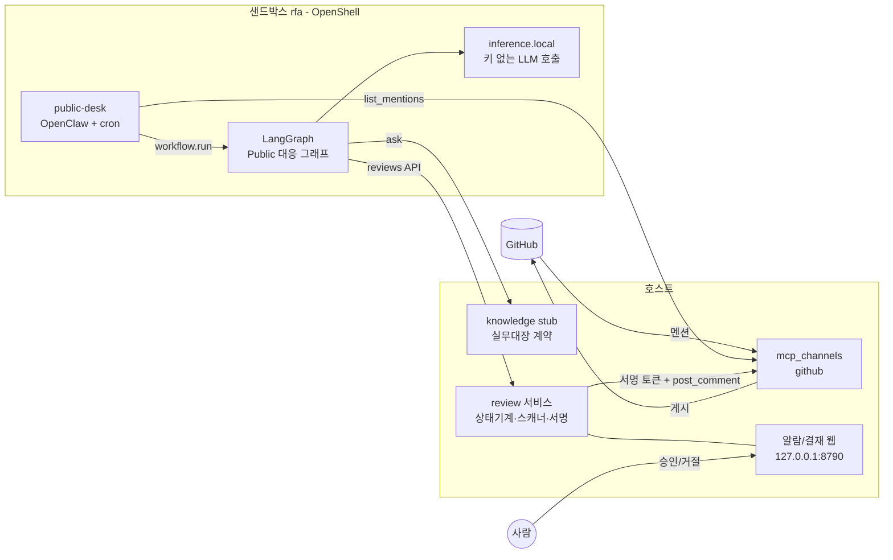

# 아키텍처

## 1. 구성 요소

| 위치 | 구성 요소 | 구현 | 문서 |
|---|---|---|---|
| 샌드박스 `rfa` | `public-desk` OpenClaw 에이전트 (+cron) | 프롬프트 + agents.yaml | modules/agents.md |
| 샌드박스 `rfa` | Public 대응 워크플로 | LangGraph, `workflow.run` 툴 | modules/workflow.md |
| 호스트 | review 서비스 (결재 문서, 스캐너, 서명, 알람/결재 웹) | FastAPI | modules/review-service.md |
| 호스트 | knowledge stub (실무대장 계약 흉내) | FastAPI | modules/knowledge-stub.md |
| 호스트 | 외부 채널 MCP (github) | FastMCP | modules/mcp-channels.md |
| 호스트 | 기밀 기준 문서, 피드백 | 파일 | modules/policy.md |

## 2. 회의록 규칙과의 대응

| 회의록 규칙 | 구현 |
|---|---|
| 외부채널 담당자는 supervisor(비서/실무대장)와만 소통 | writer는 knowledge 계약(`/tasks/{id}/ask`)으로만 지식을 얻음 |
| task 내 소통은 supervisor 경유 | public-desk가 그래프를 실행, 노드끼리는 State로만 값 전달 |
| non-supervisor 간 통신은 debate 때만 | write ⇄ edit 루프 (최대 2회) |
| 기밀검토 2-A Internal / 2-B Public | censor_internal / censor_public 노드, 정책 스코프 분리 |
| Human in the loop로 기밀 기준 관리 | 거절 사유 → feedback.jsonl → censor few-shot |

## 3. 예시 흐름: "@zetwhite ORBIT 벤치마크 진행 어때?"

| # | 어디 | 누가 판단 | 코드 | 결과 |
|---|---|---|---|---|
| 1 | GitHub | 사람 | — | issue #34 댓글 |
| 2 | 샌드박스 | OpenClaw cron | `agents.yaml` cron | public-desk 깨움 |
| 3 | 샌드박스 | LLM (public-desk) | `agents/public-desk/AGENTS.md` | `github.list_mentions` 호출 결정 |
| 4 | 호스트 | 코드 | `services/mcp_channels/github.py::list_mentions` | GitHub API → Mention 목록 |
| 5 | 샌드박스 | LLM (public-desk) | AGENTS.md | `workflow.run(mention)` 호출 |
| 6 | 샌드박스 | 코드 | `workflow/.../mcp_entry.py` | 그래프 실행 시작 |
| 7 | 샌드박스→호스트 | 코드 (intake) | `nodes/intake.py` → `POST /reviews` | review #12 `opened`. **알람 등장** |
| 8 | 샌드박스→호스트 | LLM(task 선택) + 코드 | `nodes/knowledge.py` → `GET /tasks`, `POST /tasks/orbit/ask` | answer + sources. `knowledge_ready` |
| 9 | 샌드박스 | LLM (writer) | `nodes/press.py`, `prompts/writer.md` | 초안 |
| 10 | 샌드박스 | LLM (editor) | `prompts/editor.md` | pass / revise(+notes). revise면 9로, 최대 2회 |
| 11 | 샌드박스→호스트 | 코드 (submit) | `POST /reviews/12/draft` → `scanner.py` 자동 | `drafted` → `scanned`. 스캔 결과 기록 |
| 12 | 샌드박스→호스트 | LLM (censor_public) | `nodes/censor.py`, `prompts/censor_public.md`, `GET /policy/public` | verdict allow/redact/block + 사유. `POST /reviews/12/verdict` → `reviewed` |
| 13 | 샌드박스 | 코드 | 그래프 END | public-desk에 "review #12 결재 대기" 반환 |
| 14 | 호스트 | 사람 | 결재 웹 | 원본↔수정안 비교 후 승인 |
| 15 | 호스트 | 코드 | `approval.py` (loopback만) → `clearance.sign` → `github.post_comment` | `approved` → `posted`. GitHub에 수정본 게시 |

거절 시: 15 대신 `rejected`, 사유가 `data/policy/feedback.jsonl`에 추가되어 다음 12번에 few-shot으로 주입.
(예정) 재결재 경로: 거절 사유를 갖고 writer가 재작성(`rejected → drafted`)해 같은 관문을 다시 통과하고, 게시 실패 문서는 결재 웹에서 재게시한다. `docs/modules/review-service.md` 참고.

데모용 stub 지식(`data/knowledge/orbit/`)에는 일부러 다음을 섞는다: 미공개 릴리즈 일자(official), 몰래 쓰는 GPU pool(personal), 내부 IP·토큰(scanner). 12번에서 이들이 각각 어떤 기준으로 걸리는지 결재 웹에 보이게 한다.

## 4. Tool call 정책표 (다영님 OpenShell 권한 설정용)

| 호출 주체 | 툴/엔드포인트 | 종류 | 외부 영향 | 결재 |
|---|---|---|---|---|
| public-desk | `github.list_mentions`, `github.get_thread` | MCP 읽기 | 없음 | 불필요 |
| public-desk | `workflow.run` | 샌드박스 내부 | 없음 | 불필요 |
| LangGraph 노드 | `knowledge: GET /tasks, POST /tasks/{id}/ask` | OpenAPI 읽기 | 없음 | 불필요 |
| LangGraph 노드 | `review: POST /reviews, /knowledge, /draft, /verdict`, `GET /policy/*` | OpenAPI 쓰기(내부 상태) | 없음 | 불필요 |
| LangGraph 노드 | `https://inference.local` | LLM | 없음 | 불필요 |
| 호스트 (결재 후) | `github.post_comment` | 외부 게시 | **있음** | **필수, 서명 검증** |
| 사람만 | `POST /reviews/{id}/approve\|reject` | 결재 | — | 호스트 loopback만 허용 |
| 아무도 | approve, post_comment를 샌드박스에서 호출 | — | — | 네트워크 정책 + 서버 검증으로 차단 |

## 5. 보안 경계

- 샌드박스에는 GitHub 토큰, 서명 키, LLM 키가 없다. LLM 키는 OpenShell 게이트웨이가 `inference.local`에서 주입한다.
- 게시는 호스트 코드만 하며, `clearance = HMAC(review_id, target, sha256(body), exp)` 검증을 통과해야 한다. 승인된 본문과 다른 본문은 해시가 달라 거부된다.
- 승인 엔드포인트는 호스트 loopback 요청만 받는다. 샌드박스는 그 포트로 가는 정책이 없다.
- 순서는 review 서비스 상태기계가 강제한다. LLM이 단계를 건너뛰면 409로 거부되고 문서는 멈춘다.
- 게시된 답글은 사용자 계정 이름으로 달리므로, 본문 끝에 보이지 않는 `<!-- rfa-bot -->` 표시를 붙인다. 멘션 검색은 이 표시가 있는 글만 건너뛰어, 시스템이 자기 답글에 반응해 결재 요청을 반복 생성하지 않는다. 사용자가 직접 쓴 `@자기아이디`는 정상 요청으로 받는다.

## 6. 패턴 매핑

| 패턴 | 해당 부분 |
|---|---|
| Supervisor / Hierarchical teams | 비서 → Public/Internal 대응 담당자, 실무대장 → task 에이전트 |
| Routing | 채널 보안 범위 → censor_public / censor_internal |
| Prompt chaining | 고정 그래프 intake → … → censor |
| Evaluator-optimizer | write ⇄ edit |
| Human-in-the-loop | 결재 웹 |
| Sub-agent as a tool | `workflow.run`, `knowledge ask` |

## 7. 팀 통합

- 민섭님: `contracts/knowledge.openapi.yaml`을 구현하면 `KNOWLEDGE_URL`만 바꾼다.
- 다영님: `contracts/review.openapi.yaml`로 알람/결재 화면을 대체. 4장 정책표로 OpenShell 권한 설정. `agents/agents.yaml` 조각을 통합 매니페스트에 합친다.
- Internal 채널(Confluence, L&D Hub)은 `mcp_channels/`에 서버를 추가하고, 그래프는 `channel` 값과 censor 노드만 바꾼다.
