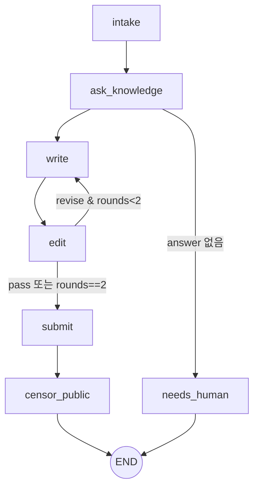

# workflow (샌드박스) — LangGraph Public 대응 그래프

## 역할

멘션 하나를 "결재 대기"까지 데려가는 고정 그래프. LLM이 흐름을 고르지 않는다. LLM은 노드 안에서만 판단한다(task 선택, 초안, 첨삭, 기밀 판정). 순서의 최종 보증은 호스트 review 서비스 상태기계가 한다.

## 그래프



## State

```python
class State(TypedDict, total=False):
    mention: Mention                 # 입력 (channel 은 mention.channel)
    review_id: int
    knowledge: KnowledgeResult       # answer, confidence, sources
    draft: str
    edit_notes: str | None
    edit_log: list[EditVerdict]
    rounds: int
    scan: list[ScanHit]              # submit 응답에서 받음
    verdict: Verdict
    failure: str                     # 설정되면 다음 노드 대신 needs_human
    outcome: Literal["reviewed","needs_human"]
```

## 노드

| 노드 | 파일 | 입력 | 호출 | 출력 | 프롬프트 |
|---|---|---|---|---|---|
| intake | `nodes/intake.py` | mention | `POST /reviews` | review_id | — |
| ask_knowledge | `nodes/knowledge.py` | mention | `GET /tasks` → LLM이 task_id 선택(enum, 없으면 `none`) → `POST /tasks/{id}/ask` → `POST /reviews/{id}/knowledge` | knowledge | `prompts/pick_task.md` |
| write | `nodes/press.py` | question, knowledge, edit_notes, style | LLM | draft | `prompts/writer.md` + `prompts/style_public.md` |
| edit | `nodes/press.py` | draft, knowledge, question | LLM (JSON: `{verdict: pass\|revise, notes, issues[]}`) | edit_log, rounds, edit_notes | `prompts/editor.md` |
| submit | `nodes/submit.py` | draft, edit_log | `POST /reviews/{id}/draft` | scan | — |
| censor_public | `nodes/censor.py` | draft, scan, sources, policy | `GET /policy/public` → LLM (JSON Verdict) → `POST /reviews/{id}/verdict` | verdict | `prompts/censor_public.md` |
| needs_human | `nodes/intake.py` | reason | `POST /reviews/{id}/needs-human` | outcome | — |

Verdict JSON (censor 출력, 스키마 강제):
```json
{ "verdict": "allow|redact|block",
  "redacted_body": "...",
  "reasons": [{"rule": "official:release-date|personal:gpu-pool|scanner:private_ip|...", "span": "원문 구절", "action": "remove|blur|keep"}],
  "summary": "한 줄" }
```

editor 기준(프롬프트): 질문에 답했는가, sources에 없는 사실을 지어냈는가, 채널 스타일(길이, 톤)에 맞는가. 기밀 판단은 하지 않는다(censor 몫).

## LLM 호출 (`llm.py`)

- Anthropic 공식 SDK. 모델은 env `RFA_MODEL`(기본 `claude-opus-5`).
- 샌드박스: `ANTHROPIC_BASE_URL=https://inference.local`, 키는 비워 둔다(OpenShell 게이트웨이가 주입, SDK 에는 `"unused"`). 호스트 개발: `ANTHROPIC_API_KEY`.
- JSON 이 필요한 호출(task 선택, 첨삭 판정, 기밀 판정)은 **structured outputs**(`messages.parse(output_format=<pydantic>)`). 최신 모델은 강제 tool_choice 를 400 으로 거부하므로 쓰지 않는다.
- `stop_reason` 이 `refusal`/`max_tokens` 이거나 출력이 비면 `LLMError` → 그 문서는 `needs_human`.
- `RFA_LLM_MODE=mock` 이면 `RuleLLM`: 키 없이 끝까지 돌려 보는 결정적 흉내. writer 는 지식을 그대로 옮기고(기밀이 초안에 흘러 검토 장면이 드러남), editor 는 항상 pass, censor 는 스캐너 hit 가 든 문장만 지운다. 정책(모델명·일정 등) 판단은 못 한다.
- 모든 LLM 호출은 `(name, system, user, context)`. `context` 는 RuleLLM 만 쓴다.
- 서버측 refusal fallback(`fallbacks`)은 쓰지 않는다. 거절되면 사람이 보는 게 이 모듈의 설계이고, 샌드박스 게이트웨이가 베타 헤더를 넘기는지 확인되지 않았다.

## 실패 처리

어느 노드든 아래 예외는 `failure` 로 바뀌고 `needs_human` 노드로 간다. `needs_human` 은 사유를 `POST /reviews/{id}/needs-human` 으로 남긴다(이미 끝난 문서라 409 면 무시).

| 예외 | 언제 |
|---|---|
| `NoKnowledge` | task 가 `none` 이거나 실무대장 답이 비었음 |
| `LLMError` | 거절, 잘림, 빈 응답, censor 형식 오류 2회 |
| `ReviewConflict` | review 상태기계 409 (누가 먼저 문서를 옮김) |
| `ServiceError` | 호스트 서비스 4xx/5xx |

censor 출력이 `Verdict` 검증(rule 형식, redact 인데 본문 없음 등)에 실패하면 오류 메시지를 붙여 **한 번 더** 시킨다.

## 호스트 호출 (`clients.py`)

- `REVIEW_URL`(기본 `http://127.0.0.1:8790`), `KNOWLEDGE_URL`(기본 `:8791`). 샌드박스 안에서는 `https://rfa-host.local/...` (Step 10).
- 요청마다 `X-RFA-Actor` 로 노드 이름을 보낸다(intake, knowledge, press, censor_public, workflow) → 결재 문서 events.

## 실행과 노출

- CLI: `python -m rfa_workflow run --mention-file m.json` (또는 `--mention-json`). 결과 `{review_id, outcome, summary}` 한 줄 JSON.
- stdio MCP (`python -m rfa_workflow.mcp_entry`): 툴 `run(mention) -> RunResult`. OpenClaw public-desk 가 부른다(Step 10, nemoclaw `mcp add` 는 HTTP 전용이라 openclaw config 로 직접 등록). 안 되면 exec 스킬로 CLI 를 부르는 2안.

## 파일 구조

```
common/rfa_common/models.py   # 공용 모델 (호스트 서비스와 공유, 워크플로가 서비스 패키지를 끌고 가지 않게 분리)
workflow/
├─ pyproject.toml             # rfa-common, langgraph, anthropic, httpx, mcp
├─ rfa_workflow/
│  ├─ graph_public.py         # 그래프 + run(mention, deps)
│  ├─ state.py                # State, RunResult
│  ├─ deps.py                 # Deps(review, knowledge, llm).from_env()
│  ├─ nodes/ intake.py(needs_human 포함), knowledge.py, press.py, submit.py, censor.py
│  ├─ llm.py                  # AnthropicLLM, RuleLLM, make_llm, prompt()
│  ├─ clients.py              # ReviewClient, KnowledgeClient
│  ├─ prompts/ pick_task.md, writer.md, style_public.md, editor.md, censor_public.md
│  ├─ cli.py, __main__.py
│  └─ mcp_entry.py
└─ tests/  wf_support.py(FakeLLM, 실제 review·knowledge 앱을 프로세스 안에서), test_graph.py, test_llm_cli_entry.py
```

## 다른 모듈과의 연결

| 상대 | 방향 |
|---|---|
| public-desk | 들어옴: `workflow.run` |
| knowledge stub / 실무대장 | 나감 |
| review 서비스 | 나감 |
| inference.local | 나감 |

## 할 일

- [x] State, graph, 조건 분기
- [x] 노드 7개(needs_human 포함) + 프롬프트 5개
- [x] llm.py (Anthropic/Rule), clients.py
- [x] 테스트: pass 경로, revise→pass, revise 2회 상한, task 없음/지식 없음/거절/409/censor 형식 오류 → needs_human, censor 재시도
- [x] mcp_entry / cli
- [ ] 실제 LLM 으로 1회 실행 → Step 9

## 미정

- Internal 그래프(9/27)를 별도 파일로 둘지 `channel` 파라미터로 분기할지. 노드 대부분이 같으므로 파라미터 분기 예정.
- editor 반려 상한 2회가 데모 시간에 적절한지(LLM 4회 호출).
