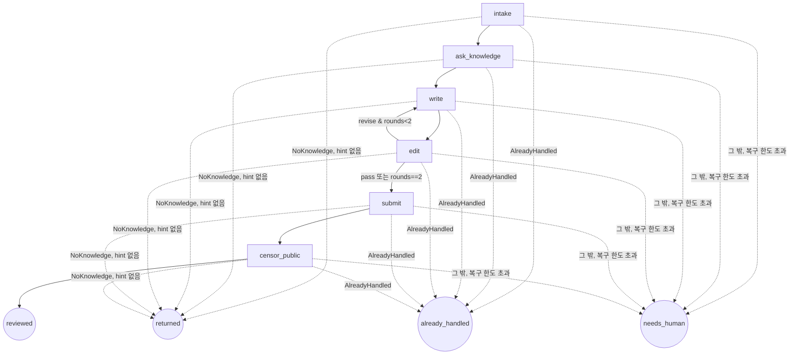

# workflow (샌드박스) — LangGraph Public 대응 그래프

## 역할

멘션 하나를 "결재 대기"까지 데려가는 고정 그래프. LLM이 흐름을 고르지 않는다. LLM은 노드 안에서만 판단한다(task 선택, 초안, 첨삭, 기밀 판정). 순서의 최종 보증은 호스트 review 서비스 상태기계가 한다.

## 그래프



실행 결과(`RunResult.outcome`):

| outcome | 뜻 | 호출한 쪽(public-desk)이 할 일 |
|---|---|---|
| `reviewed` | 결재 대기까지 도착 | 보고만 |
| `returned` | 관련 업무·지식을 못 찾음. 문서는 `opened` 그대로 | 질문을 보완해 `hint` 와 함께 **같은 멘션으로 한 번** 다시 부른다(같은 문서를 이어 씀) |
| `already_handled` | 문서가 이미 결재 대기(reviewed) 이후이거나 사람 손에 있음 | 보고만 (다시 하지 않음) |
| `needs_human` | 복구 한도 초과, 또는 사람의 정보·판단이 필요 | 보고만. 사유와 복구 내역은 결재 문서에 남아 있음 |

## State

```python
class State(TypedDict, total=False):
    mention: Mention                 # 입력 (channel 은 mention.channel)
    review_id: int
    knowledge: KnowledgeResult       # answer, confidence, sources
    draft: str
    edit_notes: str | None
    edit_log: list[EditVerdict]
    rounds: int
    scan: list[ScanHit]              # submit 응답에서 받음
    verdict: Verdict
    failure: str                     # 설정되면 다음 노드 대신 needs_human
    outcome: Literal["reviewed","needs_human"]
```

## 노드

| 노드 | 파일 | 입력 | 호출 | 출력 | 프롬프트 |
|---|---|---|---|---|---|
| intake | `nodes/intake.py` | mention | `POST /reviews` | review_id | — |
| ask_knowledge | `nodes/knowledge.py` | mention | `GET /tasks` → LLM이 task_id 선택(enum, 없으면 `none`) → `POST /tasks/{id}/ask` → `POST /reviews/{id}/knowledge` | knowledge | `prompts/pick_task.md` |
| write | `nodes/press.py` | question, knowledge, edit_notes, style | LLM | draft | `prompts/writer.md` + `prompts/style_public.md` |
| edit | `nodes/press.py` | draft, knowledge, question | LLM (JSON: `{verdict: pass\|revise, notes, issues[]}`) | edit_log, rounds, edit_notes | `prompts/editor.md` |
| submit | `nodes/submit.py` | draft, edit_log | `POST /reviews/{id}/draft` | scan | — |
| censor_public | `nodes/censor.py` | draft, scan, sources, policy | `GET /policy/public` → LLM (JSON Verdict) → `POST /reviews/{id}/verdict` | verdict | `prompts/censor_public.md` |
| needs_human | `nodes/intake.py` | reason | `POST /reviews/{id}/needs-human` | outcome | — |

Verdict JSON (censor 출력, 스키마 강제):
```json
{ "verdict": "allow|redact|block",
  "redacted_body": "...",
  "reasons": [{"rule": "official:release-date|personal:gpu-pool|scanner:private_ip|...", "span": "원문 구절", "action": "remove|blur|keep"}],
  "summary": "한 줄" }
```

editor 기준(프롬프트): 질문에 답했는가, sources에 없는 사실을 지어냈는가, 채널 스타일(길이, 톤)에 맞는가. 기밀 판단은 하지 않는다(censor 몫).

## LLM 호출 (`llm.py`)

- Anthropic 공식 SDK. 모델은 env `RFA_MODEL`(기본 `claude-opus-5`).
- 샌드박스: `ANTHROPIC_BASE_URL=https://inference.local`, 키는 비워 둔다(OpenShell 게이트웨이가 주입, SDK 에는 `"unused"`). 호스트 개발: `ANTHROPIC_API_KEY`.
- JSON 이 필요한 호출(task 선택, 첨삭 판정, 기밀 판정)은 **structured outputs**(`messages.parse(output_format=<pydantic>)`). 최신 모델은 강제 tool_choice 를 400 으로 거부하므로 쓰지 않는다.
- `stop_reason` 이 `refusal`/`max_tokens` 이거나 출력이 비면 `LLMError` → 그 문서는 `needs_human`.
- `RFA_LLM_MODE=mock` 이면 `RuleLLM`: 키 없이 끝까지 돌려 보는 결정적 흉내. writer 는 지식을 그대로 옮기고(기밀이 초안에 흘러 검토 장면이 드러남), editor 는 항상 pass, censor 는 스캐너 hit 가 든 문장만 지운다. 정책(모델명·일정 등) 판단은 못 한다.
- 모든 LLM 호출은 `(name, system, user, context)`. `context` 는 RuleLLM 만 쓴다.
- 서버측 refusal fallback(`fallbacks`)은 쓰지 않는다. 거절되면 사람이 보는 게 이 모듈의 설계이고, 샌드박스 게이트웨이가 베타 헤더를 넘기는지 확인되지 않았다.

## 실패 처리와 자동 복구

**복구 예산**: 실행 한 번에 자동 복구는 합계 3회(`recovery.MAX_RECOVERIES`). 원인과 상관없이 넘으면 `needs_human`. 쓴 내역은 `RunResult.recoveries`와 needs_human 사유에 남는다.

| 원인 | 자동 복구 | 복구 안 되면 |
|---|---|---|
| 일시적 오류: 연결 실패·타임아웃, 429, 5xx (호스트 서비스) | `clients.py`가 backoff 0.5s → 1s → 2s 로 최대 3번 재시도 (재시도마다 예산 1) | `ServiceError` → needs_human |
| 일시적 오류 (LLM) | Anthropic SDK 가 429/5xx/연결 오류를 기본 2번 재시도 (예산 미사용) | `LLMError` → needs_human |
| 409 상태 충돌 | 최신 문서 조회 → **내 요청이 이미 반영됨**(재시도 중 첫 요청이 사실 성공)이면 성공으로 보고 계속. 이미 성공한 것이므로 **예산을 쓰지 않고 기록만** 한다(예산이 바닥나도 성공은 성공). 이미 사람이 처리한 문서(approved/posted/rejected/needs_human)면 `AlreadyHandled` | 그 밖의 충돌 `ReviewConflict` → needs_human |
| 관련 업무·지식 없음 | 고른 task 가 빈 답이면 그 task 를 빼고 **한 번 더** 고름 (예산 1). task 가 `none` 이면 재선택하지 않음 | `returned` 로 supervisor 에게. supervisor 가 `hint` 를 준 재요청에서도 없으면 needs_human |
| LLM 거절·잘림·빈 응답, censor 형식 오류 2회 | 없음 (censor 형식 오류는 1회 재시도) | needs_human |
| 한도 초과 | — | `RecoveryExhausted` → needs_human |

**중복 처리 방지**
- 문서 생성: review 서비스가 `source_url` 로 멱등. 재시도·재요청·중단 후 재실행은 같은 문서를 받는다.

**중단 후 재실행 (intake 가 문서 상태로 시작 지점을 정한다)**

| 받은 문서 상태 | 시작 지점 | 쓰는 저장 데이터 |
|---|---|---|
| `opened` | ask_knowledge (처음부터) | — |
| `knowledge_ready` | write | 지식 |
| `scanned` | censor_public | 지식, 초안, 첨삭 이력, 스캔 결과 |
| `reviewed` 이후, `needs_human` | 없음 → `already_handled` | — |
| `drafted` (정상적으로는 남지 않음: scanned 와 한 번에 저장) | 없음 → needs_human | — |

재개했으면 `RunResult.resumed_from` 에 그때 상태가 남는다.
- 초안·지식·판정 제출: 응답을 못 받아 재시도하면 서버는 409 → 최신 문서에 내 내용이 있으면 성공으로 본다. 제출이 두 번 반영되는 일이 없다(events 에 한 번만).

## 호스트 호출 (`clients.py`)

- `REVIEW_URL`(기본 `http://127.0.0.1:8790`), `KNOWLEDGE_URL`(기본 `:8791`). 샌드박스 안에서는 `http://$RFA_SANDBOX_HOST:8790`, `:8791` (`/sandbox/rfa-workflow.env`, `policies/rfa-host.yaml` 이 여는 경로만).
- 요청마다 `X-RFA-Actor` 로 노드 이름을 보낸다(intake, knowledge, press, censor_public, workflow) → 결재 문서 events.

## 실행과 노출

- CLI: `rfa-workflow [--env-file F] run --mention-file m.json [--hint "..."]` (또는 `--mention-json`, `--from-review ID`). 결과 `{review_id, target, outcome, summary, recoveries, ...}` 한 줄 JSON.
  - `--env-file`: `KEY=VALUE` 설정 파일. 이미 있는 환경변수는 덮지 않는다. 샌드박스에서는 exec 명령을 고정하려고 설정을 파일 하나로 넘긴다.
  - `--from-review ID`: 저장된 결재 문서에서 멘션을 되살려 다시 실행(`returned` 뒤 hint 재요청). LLM 이 멘션 JSON 을 만들지 않아도 된다.
- 데스크: `rfa-workflow desk-once`. GitHub MCP(`GITHUB_MCP_URL`=`/github/desk/mcp`, `GITHUB_MCP_TOKEN`)의 `list_mentions` 로 새 멘션을 받아 하나씩 `run`. `returned` 는 다시 부르지 않고 결과만 낸다.
  - 샌드박스(Step 10): public-desk 가 exec 로 실행하고, `returned` 면 hint 를 써서 `run --from-review` 로 한 번 재요청한다 (`docs/modules/agents.md`).
  - 호스트(Step 9): `scripts/demo_host.sh`. 샌드박스 연결이 막혔을 때의 대안.
  - 에이전트용 MCP 경로(`/github/mcp`)는 OpenShell 이 `list_mentions` 를 막으므로 데스크는 `/github/desk/mcp` 를 쓴다.

## 파일 구조

```
common/rfa_common/models.py   # 공용 모델 (호스트 서비스와 공유, 워크플로가 서비스 패키지를 끌고 가지 않게 분리)
workflow/
├─ pyproject.toml             # rfa-common, langgraph, anthropic, httpx, mcp
├─ rfa_workflow/
│  ├─ graph_public.py         # 그래프 + run(mention, deps)
│  ├─ state.py                # State, RunResult
│  ├─ deps.py                 # Deps(review, knowledge, llm).from_env()
│  ├─ nodes/ intake.py(needs_human 포함), knowledge.py, press.py, submit.py, censor.py
│  ├─ llm.py                  # AnthropicLLM, RuleLLM, make_llm, prompt()
│  ├─ clients.py              # ReviewClient, KnowledgeClient (재시도, 409 해소)
│  ├─ recovery.py             # RecoveryBudget (실행당 복구 합계 상한)
│  ├─ prompts/ pick_task.md, writer.md, style_public.md, editor.md, censor_public.md
│  ├─ cli.py, __main__.py       # run / desk-once, --env-file, --from-review (console script: rfa-workflow)
│  └─ desk.py                 # 데스크: McpTools(최소 JSON-RPC) + poll_once
└─ tests/  wf_support.py(FakeLLM, FlakyHttp 장애 주입, 실제 review·knowledge 앱을 프로세스 안에서),
          test_graph.py, test_recovery.py, test_llm_cli_entry.py, test_desk.py
```

## 다른 모듈과의 연결

| 상대 | 방향 |
|---|---|
| public-desk | 들어옴: exec `rfa-workflow desk-once`, `run --from-review --hint` |
| knowledge stub / 실무대장 | 나감 |
| review 서비스 | 나감 |
| inference.local | 나감 |

## 할 일

- [x] State, graph, 조건 분기
- [x] 노드 7개(needs_human 포함) + 프롬프트 5개
- [x] llm.py (Anthropic/Rule), clients.py
- [x] 테스트: pass 경로, revise→pass, revise 2회 상한, 거절/censor 형식 오류 → needs_human, censor 재시도
- [x] 복구 경로별 테스트 (`test_recovery.py`): 재시도 성공 / 재시도 한도 초과, 응답 유실 후 재시도해도 한 번만 반영, 예산 소진 후에도 이미 반영된 요청은 성공, knowledge_ready·scanned 에서 중단 후 재실행 → 재개, 재개 불가 상태 → needs_human, 409 사람이 처리한 문서 → already_handled / 해소 불가 → needs_human, task 재선택 성공, returned → hint 로 같은 문서 재개, hint 후에도 없음 → needs_human, 원인 섞어 합계 한도 초과
- [x] cli (`run`, `desk-once`, `--env-file`, `--from-review`)
- [x] 실제 LLM 으로 1회 실행 (Step 9 호스트, Step 10 샌드박스)

## 미정

- Internal 그래프(9/27)를 별도 파일로 둘지 `channel` 파라미터로 분기할지. 노드 대부분이 같으므로 파라미터 분기 예정.
- editor 반려 상한 2회가 데모 시간에 적절한지(LLM 4회 호출).
