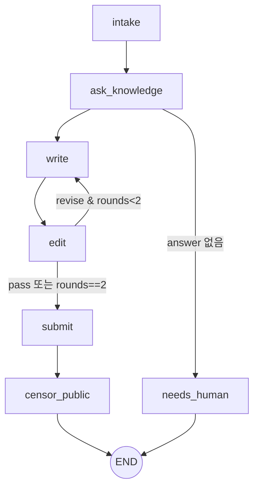

# workflow (샌드박스) — LangGraph Public 대응 그래프

## 역할

멘션 하나를 "결재 대기"까지 데려가는 고정 그래프. LLM이 흐름을 고르지 않는다. LLM은 노드 안에서만 판단한다(task 선택, 초안, 첨삭, 기밀 판정). 순서의 최종 보증은 호스트 review 서비스 상태기계가 한다.

## 그래프



## State

```python
class State(TypedDict, total=False):
    mention: Mention                 # 입력
    channel: Literal["public","internal"]
    review_id: int
    knowledge: KnowledgeResult       # answer, confidence, sources
    draft: str
    edit_notes: str | None
    edit_log: list[EditVerdict]
    rounds: int
    scan: list[ScanHit]              # submit 응답에서 받음
    verdict: Verdict | None
    outcome: Literal["reviewed","needs_human"]
```

## 노드

| 노드 | 파일 | 입력 | 호출 | 출력 | 프롬프트 |
|---|---|---|---|---|---|
| intake | `nodes/intake.py` | mention | `POST /reviews` | review_id | — |
| ask_knowledge | `nodes/knowledge.py` | mention | `GET /tasks` → LLM이 task_id 선택(enum, 없으면 `none`) → `POST /tasks/{id}/ask` → `POST /reviews/{id}/knowledge` | knowledge | `prompts/pick_task.md` |
| write | `nodes/press.py` | question, knowledge, edit_notes, style | LLM | draft | `prompts/writer.md` + `prompts/style_public.md` |
| edit | `nodes/press.py` | draft, knowledge, question | LLM (JSON: `{verdict: pass\|revise, notes, issues[]}`) | edit_log, rounds, edit_notes | `prompts/editor.md` |
| submit | `nodes/submit.py` | draft, edit_log | `POST /reviews/{id}/draft` | scan | — |
| censor_public | `nodes/censor.py` | draft, scan, sources, policy | `GET /policy/public` → LLM (JSON Verdict) → `POST /reviews/{id}/verdict` | verdict | `prompts/censor_public.md` |
| needs_human | `nodes/intake.py` | reason | `POST /reviews/{id}/needs-human` | outcome | — |

Verdict JSON (censor 출력, 스키마 강제):
```json
{ "verdict": "allow|redact|block",
  "redacted_body": "...",
  "reasons": [{"rule": "official:release-date|personal:gpu-pool|scanner:private_ip|...", "span": "원문 구절", "action": "remove|blur|keep"}],
  "summary": "한 줄" }
```

editor 기준(프롬프트): 질문에 답했는가, sources에 없는 사실을 지어냈는가, 채널 스타일(길이, 톤)에 맞는가. 기밀 판단은 하지 않는다(censor 몫).

## LLM 호출 (`llm.py`)

- 엔드포인트 `https://inference.local` (샌드박스 안에서 OpenShell 게이트웨이가 키 주입). Anthropic messages 형식, 모델은 env `RFA_MODEL`(기본 `claude-sonnet-4-6`).
- 호스트 로컬 테스트용: env `RFA_LLM_MODE=mock`이면 `tests/fixtures/`의 고정 응답 반환.
- JSON 출력은 tool-use 또는 응답 파싱 + pydantic 검증, 실패 시 1회 재시도.

## 호스트 호출 (`clients.py`)

- `REVIEW_URL`, `KNOWLEDGE_URL` env. 샌드박스 안에서는 `https://rfa-host.local/...`.
- 409(순서 위반) 수신 시 그래프를 중단하고 `needs_human` 기록.

## 노출 방식 (`mcp_entry.py`)

- 1안: stdio MCP 서버. 툴 `run(mention) -> {review_id, outcome, summary}`. OpenClaw `mcp.servers`에 `command: python -m rfa_workflow.mcp_entry`로 등록(nemoclaw `mcp add`는 HTTP 전용이므로 openclaw config로 직접).
- 2안: OpenClaw 스킬 + exec `python -m rfa_workflow run --mention-json '...'`.
- 셋업 5단계에서 1안 시도, 실패 시 2안.

## 파일 구조

```
workflow/
├─ pyproject.toml            # langgraph, httpx, pydantic
├─ rfa_workflow/
│  ├─ graph_public.py
│  ├─ state.py
│  ├─ nodes/ intake.py, knowledge.py, press.py, submit.py, censor.py
│  ├─ llm.py
│  ├─ clients.py
│  ├─ mcp_entry.py
│  └─ cli.py                 # python -m rfa_workflow run
├─ prompts/ pick_task.md, writer.md, editor.md, style_public.md, censor_public.md
└─ tests/ test_graph.py (mock LLM/HTTP), fixtures/
```

## 다른 모듈과의 연결

| 상대 | 방향 |
|---|---|
| public-desk | 들어옴: `workflow.run` |
| knowledge stub / 실무대장 | 나감 |
| review 서비스 | 나감 |
| inference.local | 나감 |

## 할 일

- [ ] State, graph, 조건 분기
- [ ] 노드 6개 + 프롬프트 5개
- [ ] llm.py (real/mock), clients.py
- [ ] mock 테스트: pass 경로, revise 2회 상한, knowledge 없음 → needs_human, 409 → needs_human
- [ ] mcp_entry / cli
- [ ] 호스트에서 실제 LLM으로 1회 실행 (inference.local 대신 호스트 키로)

## 미정

- Internal 그래프(9/27)를 별도 파일로 둘지 `channel` 파라미터로 분기할지. 노드 대부분이 같으므로 파라미터 분기 예정.
- editor 반려 상한 2회가 데모 시간에 적절한지(LLM 4회 호출).
